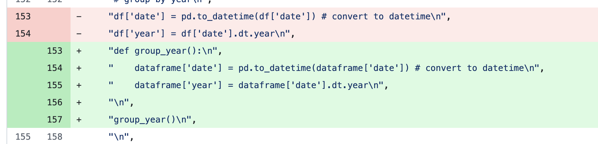

# Week 5 Major-Assignment - Enhanced Project
---

[](https://github.com/ngnk/IDS-706-Assignment-3/actions/workflows/main.yml)

---
A step-by-step tutorial that walks you through how to setup the docker environment and run this enhanced project.

---

## 1) Overview

This notebook builds on the previous assignment, eliminates unnecessary code, and focuses exclusively on a trading scenario.

This script eliminates much of the exploratory data analysis (EDA), since we already examined the information in previous assignments. The focus here is on evaluating machine learning performance as a trading strategy.

For granular details on the dataset and model performance, please refer to the notebook itself.

Simply follow the instructions below. 

---

## 2) Dataset description

The notebook expects a single CSV file (found in the repository) named **all_commodities_data.csv**, with the following columns:

- **Date** *(YYYY-MM-DD)* – trading day.
- **Open** – opening price.
- **High** – high price of the day.
- **Low** – low price of the day.
- **Close** – closing price.
- **Volume** – trading volume.
- **Commodity** – commodity name (e.g., "Gold", "Silver").
- **Ticker** – commodity code (e.g., "GC").

---

## 3) Setup Instructions

**Github clone**

Open desktop or whichever folder and cd the pathname in terminal.

Clone this repository by doing the following commands:
```bash
git init
git clone <repository URL>
```

The folder should appear in the directory.

**Verify it has the following files:**

1. **706_A3.ipynb**
2. **README.md**
3. **All_commodities_data.csv**
4. **Dockerfile**
5. **Requirements.txt**
6. **Test_script.py**
7. **MakeFile**
8. **.flake8**

## 4) Docker Setup and Environment Creation (Step-by-Step Tutorial)

1. Install Docker Desktop  
   - Download and install Docker Desktop for your OS (Mac, Windows, Linux).  
   - Open Docker Desktop and make sure the daemon is running (look for the whale 🐳 icon in your menu bar/system tray).  

2. Open the repository in VS Code  
   - Open the project folder in VS Code.  
   - Open a terminal inside VS Code (View > Terminal).  

3. Build the Docker image  
   Run this command in the terminal from the repo root (where the Dockerfile is located):

   ```bash
   docker build -t my-analysis .
   ```

5. Run the tests inside the container  
   Once the build is complete, run:

   ```bash 
   docker run --rm my-analysis
   ```
     
   This executes pytest -v inside the container.

   If setup correctly, all tests should pass as they're mainly focused on checking if the data is ok, and if the necessary packages are installed. If not, use error logs to troubleshoot.

   

## Tests Included:

The test suite checks that:  
- Data loads properly (no empty DataFrame)  
- Expected columns exist: Date, Open, High, Low, Close, Volume, Ticker, Commodity  
- No null values in price columns (Open, High, Low, Close)  
- "Gold" is present in the commodity column  
- Required packages (pandas, numpy, seaborn, matplotlib, scikit-learn) import successfully  

6. Code Quality Tools

Black Formatter

Use `black` for code formatting to ensure consistent Python code style across the project.

Usage via Makefile:
```bash
make format
 ```

Flake8 Linter

Use flake8 for linting to catch potential errors and enforce PEP 8 style guidelines.

Usage via Makefile:

```bash
make lint
 ```

---

## Running the Analysis Notebook (706_A3.ipynb)

1. Start Jupyter Notebook inside the container and expose port 8888:

   ```bash 
   docker run -it -p 8888:8888 my-analysis jupyter notebook --ip=0.0.0.0 --no-browser --allow-root
   ```

2. Copy the URL with the token from the container logs (there might be multiple, just try all and one will work)

3. Open the link in your local browser. Navigate to `706_A3.ipynb` in the Jupyter interface. Select 'Run' from the top bar, and click 'Run All Cells'.

---

> **Note:**  
> The Dockerfile is set up to run tests automatically with:
> ```
> CMD ["pytest", "-v"]
> ```
> If you want to run something else (like Jupyter) without changing the Dockerfile, you can **override the command** at runtime.  
> Example:  
> ```
> docker run -it -p 8888:8888 my-analysis jupyter notebook --ip=0.0.0.0 --no-browser --allow-root
> ```
> This will start Jupyter inside the container instead of running tests.

---
**Screenshots**
Screenshots have been included in the repository, but for simplicity's sake:

Succesful workflow:


Sample refactor:



---
