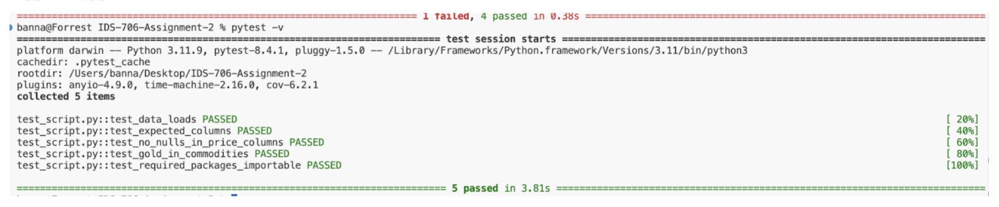

# Week 6 Major-Assignment - Enhance your mini-assignments with tools and content
---

[](https://github.com/ngnk/IDS-706-Assignment-3/actions/workflows/main.yml)

---
A step-by-step tutorial that walks you through how to setup the docker environment and run this enhanced project.

---

## 1) Overview

This notebook takes the exact same analysis from last week's commodities data project and adds Docker containerization and testing validation. 

To recap, the script uses data from commodities dating back to 2000, does some basic EDA, analysis, and filtering, before running some basic ML on the price of gold, and finally displays some visualizations.

The goal of last week's project was to get a clear picture of commodities data, pricing trends, and explore if we can accurately predict pricing trends with machine learning. In general, we found that commodities increased in price over the years, but the ML predictions need a lot of fine-tuning to be considered reliable.

---

## 2) Dataset description

The notebook expects a single CSV file (found in the repository) named **all_commodities_data.csv**, with the following columns:

- **Date** *(YYYY-MM-DD)* – trading day.
- **Open** – opening price.
- **High** – high price of the day.
- **Low** – low price of the day.
- **Close** – closing price.
- **Volume** – trading volume.
- **Commodity** – commodity name (e.g., "Gold", "Silver").
- **Ticker** – commodity code (e.g., "GC").

---

## 3) Setup Instructions

**Github clone**

Open desktop or whichever folder and cd the pathname in terminal.

Clone this repository by doing the following commands:
```bash
git init
git clone <repository URL>
```

The folder should appear in the directory.

**Verify it has the following files:**

1. **706_A3.ipynb**
2. **README.md**
3. **All_commodities_data.csv**
4. **Dockerfile**
5. **Requirements.txt**
6. **Test_script.py**

## 4) Docker Setup and Environment Creation (Step-by-Step Tutorial)

1. Install Docker Desktop  
   - Download and install Docker Desktop for your OS (Mac, Windows, Linux).  
   - Open Docker Desktop and make sure the daemon is running (look for the whale 🐳 icon in your menu bar/system tray).  

2. Open the repository in VS Code  
   - Open the project folder in VS Code.  
   - Open a terminal inside VS Code (View > Terminal).  

3. Build the Docker image  
   Run this command in the terminal from the repo root (where the Dockerfile is located):

   ```bash
   docker build -t my-analysis .
   ```

5. Run the tests inside the container  
   Once the build is complete, run:

   ```bash 
   docker run --rm my-analysis
   ```
     
   This executes pytest -v inside the container.

   If setup correctly, all tests should pass as they're mainly focused on checking if the data is ok, and if the necessary packages are installed. If not, use error logs to troubleshoot.

   

## Tests Included:

The test suite checks that:  
- Data loads properly (no empty DataFrame)  
- Expected columns exist: Date, Open, High, Low, Close, Volume, Ticker, Commodity  
- No null values in price columns (Open, High, Low, Close)  
- "Gold" is present in the commodity column  
- Required packages (pandas, numpy, seaborn, matplotlib, scikit-learn) import successfully  

---

## Running the Analysis Notebook (706_A3.ipynb)

1. Start Jupyter Notebook inside the container and expose port 8888:

   ```bash 
   docker run -it -p 8888:8888 my-analysis jupyter notebook --ip=0.0.0.0 --no-browser --allow-root
   ```

2. Copy the URL with the token from the container logs (there might be multiple, just try all and one will work)

3. Open the link in your local browser. Navigate to `706_A3.ipynb` in the Jupyter interface. Select 'Run' from the top bar, and click 'Run All Cells'.

---

> **Note:**  
> The Dockerfile is set up to run tests automatically with:
> ```
> CMD ["pytest", "-v"]
> ```
> If you want to run something else (like Jupyter) without changing the Dockerfile, you can **override the command** at runtime.  
> Example:  
> ```
> docker run -it -p 8888:8888 my-analysis jupyter notebook --ip=0.0.0.0 --no-browser --allow-root
> ```
> This will start Jupyter inside the container instead of running tests.
